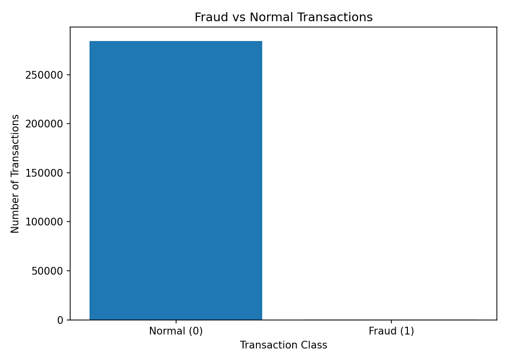
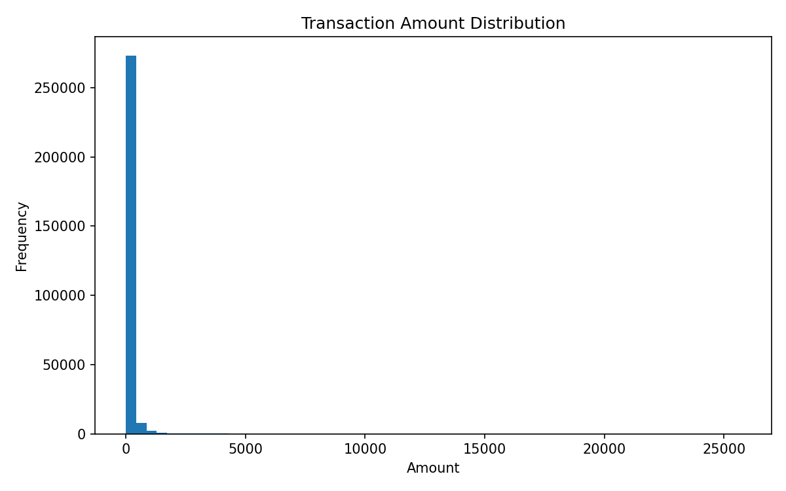
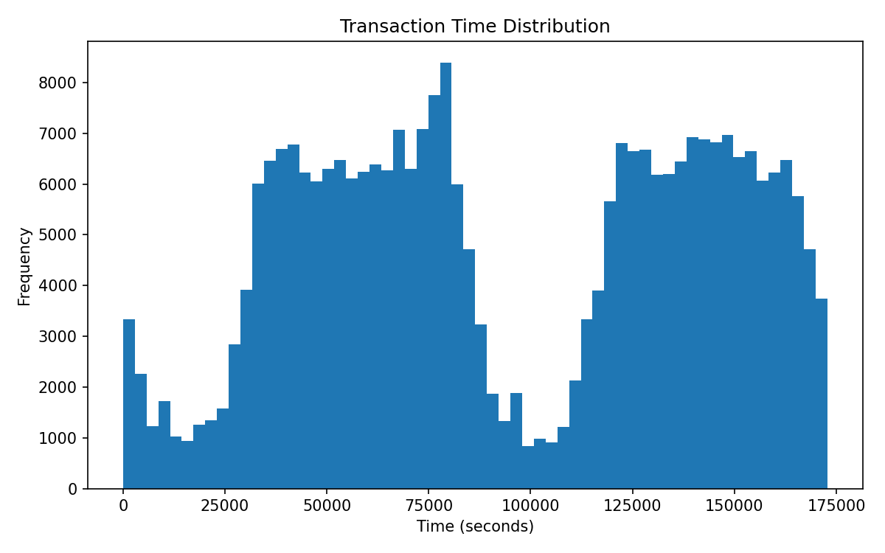
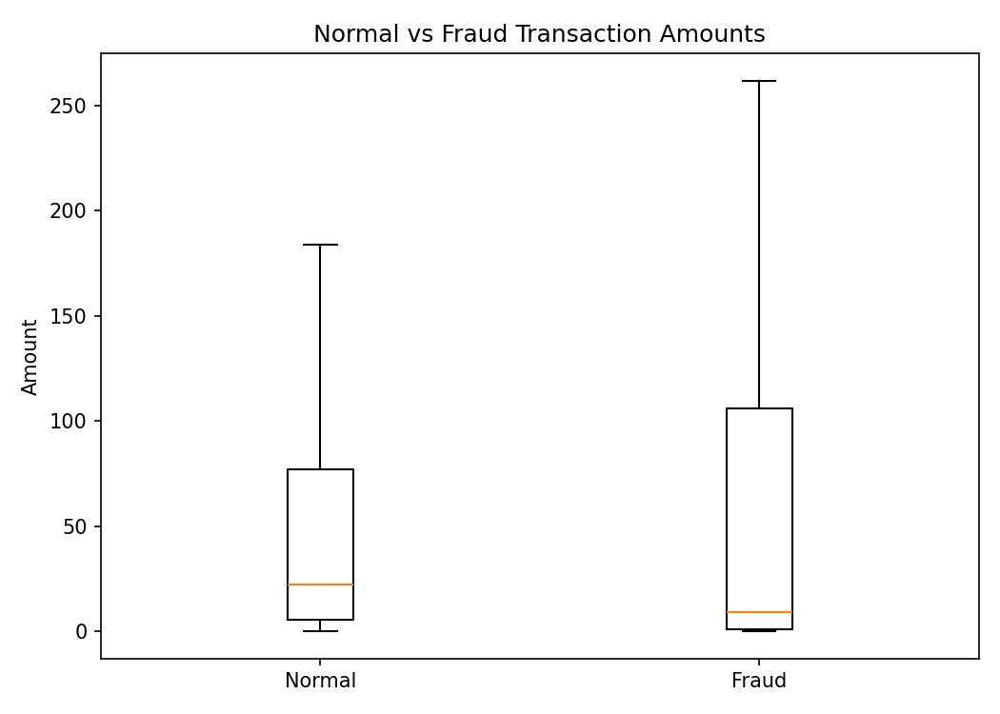
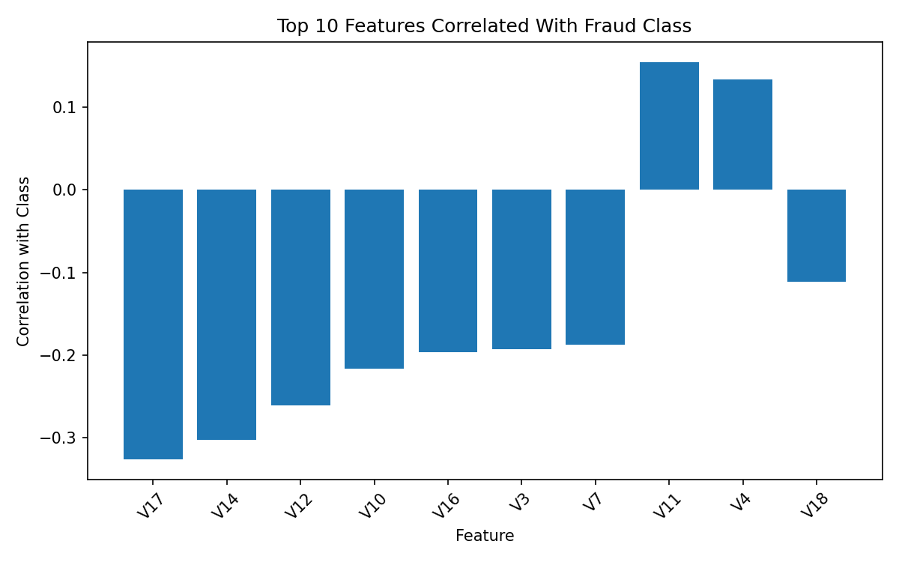
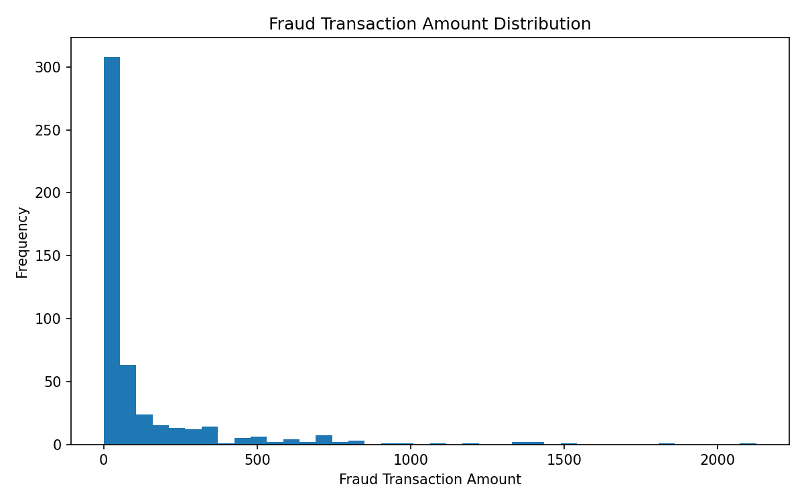

# Exploratory Analysis of Financial Transactions

## Project Type
Minor Project - Data Science Domain

## Problem Statement
Financial datasets are complex and require careful analysis to detect useful patterns. This project performs exploratory data analysis on credit card transaction data to identify transaction trends, class imbalance, and suspicious patterns related to fraud.

## Objective
To explore financial transaction data, understand transaction-level features, visualize distributions, and highlight suspicious patterns using Python, Pandas, and Matplotlib.

## Dataset
Credit Card Fraud Detection Dataset from Kaggle:
https://www.kaggle.com/datasets/mlg-ulb/creditcardfraud

The dataset contains anonymized credit card transactions. Most features are PCA-transformed for privacy.

### Important Columns
| Column | Description |
|---|---|
| Time | Seconds elapsed between transactions |
| V1 to V28 | PCA-transformed numerical features |
| Amount | Transaction amount |
| Class | Target variable: 0 = Normal, 1 = Fraud |

## Tools and Libraries Used
- Python
- Pandas
- NumPy
- Matplotlib
- Jupyter Notebook

## Data Science Techniques Used
- Exploratory Data Analysis
- Anomaly Exploration
- Class Distribution Analysis
- Transaction Amount Analysis
- Correlation Analysis
- Data Visualization

## Steps Performed
1. Loaded and inspected the transaction dataset.
2. Checked dataset shape, columns, data types, missing values, and duplicates.
3. Analyzed normal and fraudulent transaction distribution.
4. Visualized transaction amount distribution.
5. Compared normal and fraud transaction amounts.
6. Studied time-based transaction patterns.
7. Checked correlation of features with the fraud class.
8. Highlighted suspicious patterns and project conclusions.

## Key Findings
- The dataset is highly imbalanced.
- Fraud transactions are very rare compared to normal transactions.
- Fraud patterns can be explored through transaction amount, time, and PCA-transformed features.
- Some PCA features show stronger correlation with fraudulent transactions.
- EDA is useful before applying any fraud detection model.

## How to Run This Project

1. Clone or download this repository.
2. Download the dataset from Kaggle.
3. Place `creditcard.csv` inside the `data/` folder.
4. Install the required libraries:

```bash
pip install -r requirements.txt
```

5. Open the notebook:

```bash
jupyter notebook financial_transaction_eda.ipynb
```

6. Run all cells from top to bottom.

## Project Outcome
This project provides hands-on experience in analyzing complex financial transaction datasets and identifying suspicious patterns through exploratory data analysis.


## Visualizations

The `images/` folder contains generated charts from the dataset:












